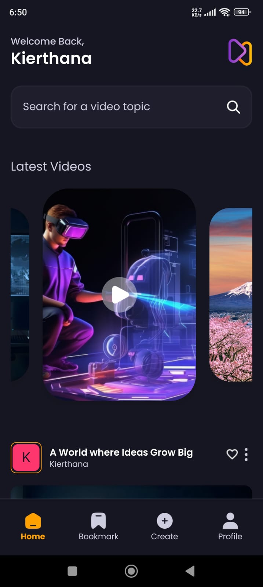

# Avivin

Avivin is a video-sharing platform built with React Native and Appwrite. Users can upload, view, like, and manage videos. 

## Features

- User Authentication
- Video Upload and Playback
- Like and Unlike Videos
- User Profiles

## Technologies Used

- React Native
- Appwrite
- Expo
- TailwindCSS

## Installation

### Prerequisites

- Node.js
- Expo CLI
- Appwrite Server

### Steps

1. **Clone the Repository**

```sh
git clone https://github.com/KierthanaRS/Avivin.git
cd Avivin
```

2. **Install Dependencies**

```sh
npm install
```

3. **Configure Appwrite**

   - Set up an Appwrite server.
   - Create a new project in Appwrite.
   - Create necessary collections and documents in Appwrite.
   - Set up your Appwrite configuration in `src/lib/appwrite.js`.

4. **Run the Application**

```sh
npx expo start
```

## Project Structure

```
.
├── src
│   ├── assets          # Image and other asset files
│   ├── components      # Reusable React components
│   ├── constants       # Constants such as images and icons
│   ├── context         # Global context for state management
│   ├── lib             # Appwrite configuration and helper functions
│   ├── navigation      # React Navigation setup
│   ├── screens         # Screen components
│   ├── styles          # Styling files
│   └── App.js          # Entry point of the application
└── package.json        # Project dependencies and scripts
```

## Usage

1. **User Authentication**

   - Users can sign up and log in to the application.

2. **Video Upload and Playback**

   - Users can upload videos and view them within the app.

3. **Like and Unlike Videos**

   - Users can like and unlike videos.

4. **User Profiles**

   - Users can view and edit their profiles.

   
   
   
   
   
   
   
   

## Contributing

Contributions are welcome! Please create a pull request or open an issue to discuss changes.


## Contact

If you have any questions or suggestions, feel free to reach out.

- [kierthana](mailto:kierthanars@gmail.com)


# Welcome to your Expo app 👋

This is an [Expo](https://expo.dev) project created with [`create-expo-app`](https://www.npmjs.com/package/create-expo-app).

## Get started

1. Install dependencies

   ```bash
   npm install
   ```

2. Start the app

   ```bash
    npx expo start
   ```

In the output, you'll find options to open the app in a

- [development build](https://docs.expo.dev/develop/development-builds/introduction/)
- [Android emulator](https://docs.expo.dev/workflow/android-studio-emulator/)
- [iOS simulator](https://docs.expo.dev/workflow/ios-simulator/)
- [Expo Go](https://expo.dev/go), a limited sandbox for trying out app development with Expo

You can start developing by editing the files inside the **app** directory. This project uses [file-based routing](https://docs.expo.dev/router/introduction).

## Get a fresh project

When you're ready, run:

```bash
npm run reset-project
```

This command will move the starter code to the **app-example** directory and create a blank **app** directory where you can start developing.

## Learn more

To learn more about developing your project with Expo, look at the following resources:

- [Expo documentation](https://docs.expo.dev/): Learn fundamentals, or go into advanced topics with our [guides](https://docs.expo.dev/guides).
- [Learn Expo tutorial](https://docs.expo.dev/tutorial/introduction/): Follow a step-by-step tutorial where you'll create a project that runs on Android, iOS, and the web.

## Join the community

Join our community of developers creating universal apps.

- [Expo on GitHub](https://github.com/expo/expo): View our open source platform and contribute.
- [Discord community](https://chat.expo.dev): Chat with Expo users and ask questions.
